# Cleaning the PSX laser internals

Shouldn't take too long, especially once you've figured out the weird geometry.
Maybe 30-60 mins the first time, but you should be able to speedrun it in about 2-3 mins thereafter.

The usual stuff:
- A credit would be cool if you reuse some of the guide.
- I'm not responsible for you hurting yourself.
- I'm not responsible for damages to your PS1.
- Unplug the playstation to avoid a nasty shock from the PSU.

Thanks to Matthew Read for originally showing me this, to AirIsOptional for one or two of the pics, and to Rama for some additional information.

# 1 - Shell

Flip the PSX up and remove the underside screws.
Once the top shell is off, we don't need to go any deeper.

### Hint!
Remember to empty the disc drive

### Hint!
Unplug the PSX

# 2 - Unplug the CD mechanism

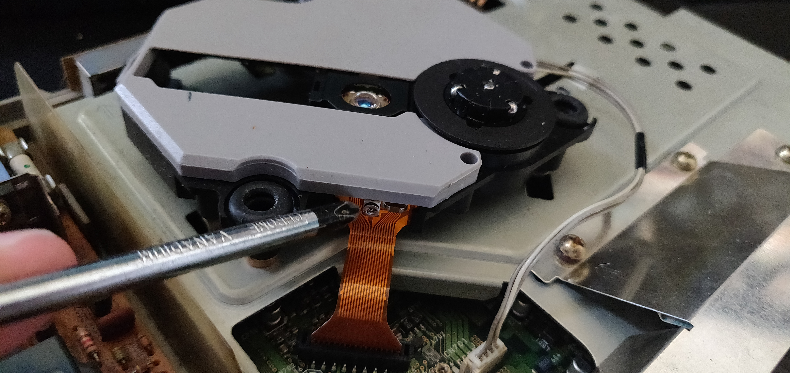

## Ribbon Cable:
Remove the ribon cable firmly and evenly, straight up.
Push down on the plastic connector with a flat screwdriver, plastic knife etc if you're worried about yanking it out.

## Motor Cable:
If you yank at this you could tear it off the board!
It's not super fragile, but don't go caveman on it.

If it's loose: carefully wiggle it gently out of place.
If it's tight: push against the motherboard connector with a flat screwdriver etc, as you remove the cable.

# 3 - It's out!

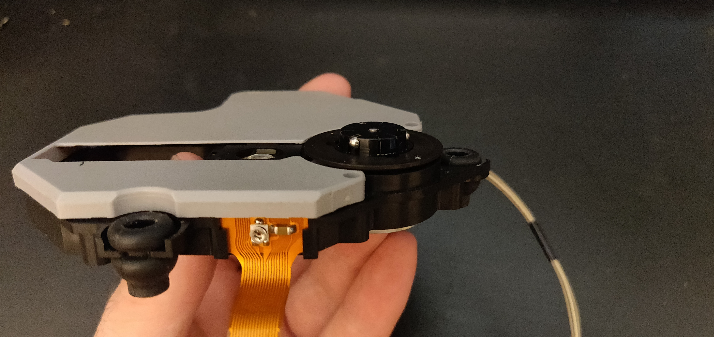

# 4 - Remove the bottom panel

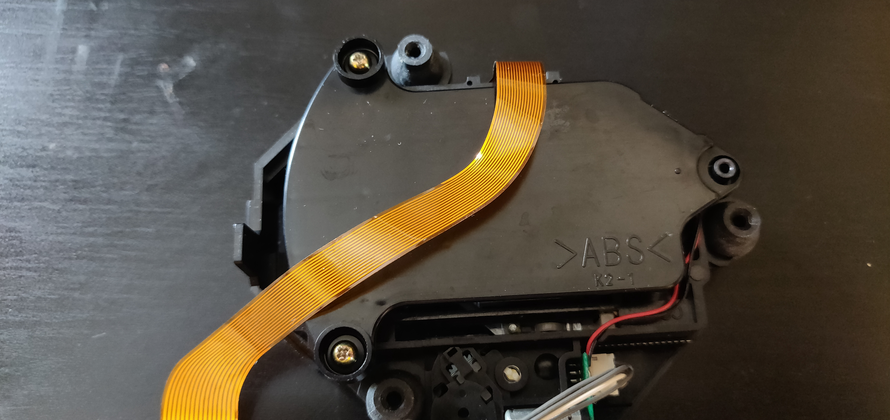
Easy bit, remove the screws, and off it comes.

# 5 - Remove the top cover

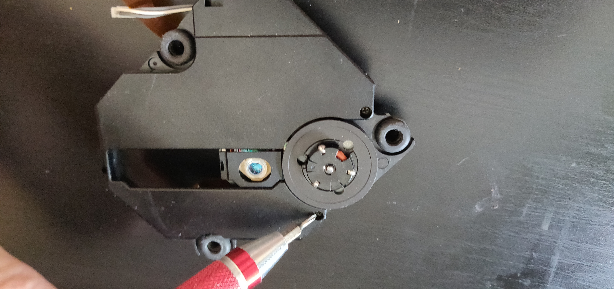

Yours might be grey or black, same procedure.
Attack the 2x screws near the spindle, and the top will slide out away from the centre

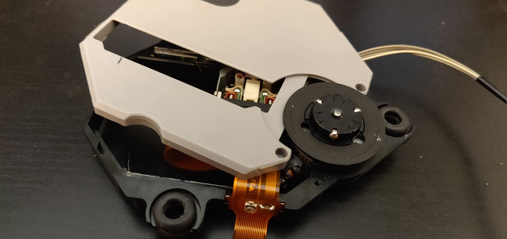
The screws are probably longer than you think - take them right out.

# 6 - Release the ribbon!

This part of the ribbon will just slide out towards the top now

easy!

# 7 - Move the sled outwards

Fiddly, but it's fine when you get it.

From Here:
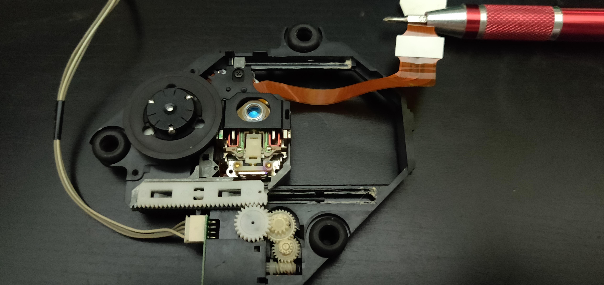

To Here:
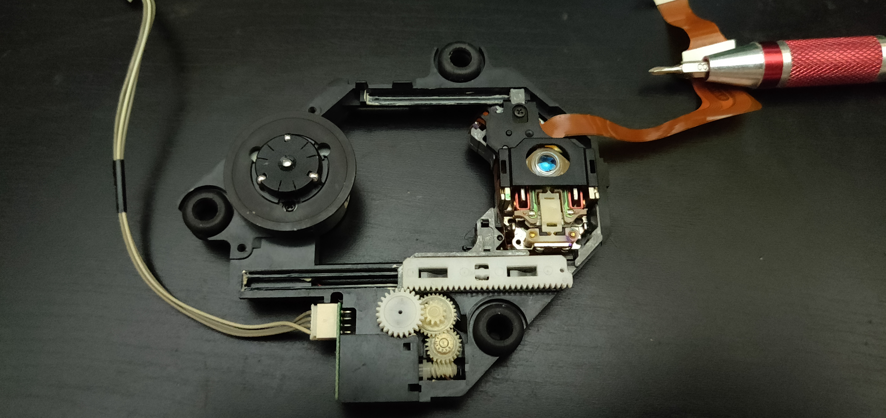

Some scribbles from discord:
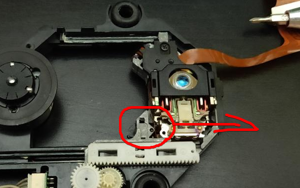
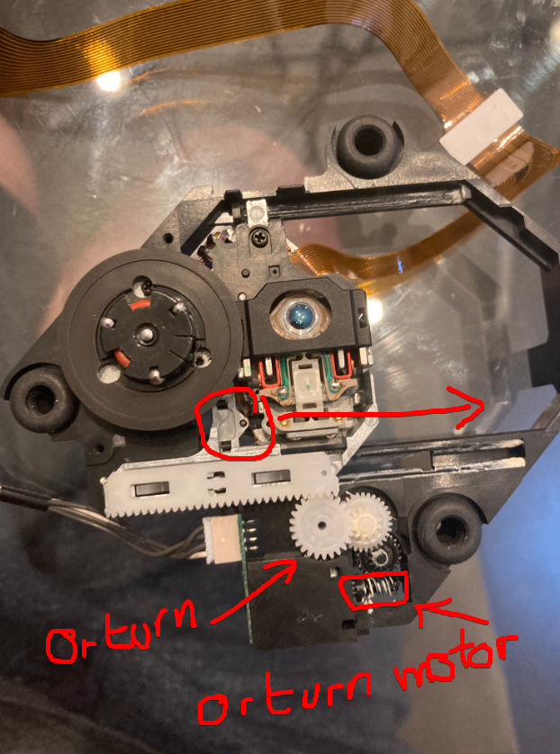

With some force, it'll just move, but you could also move it manually.

# 8 - Pop out the white thing with the teeth

Fiddly, but again, makes sense when you get it.
Second time will take you all of 3 seconds.

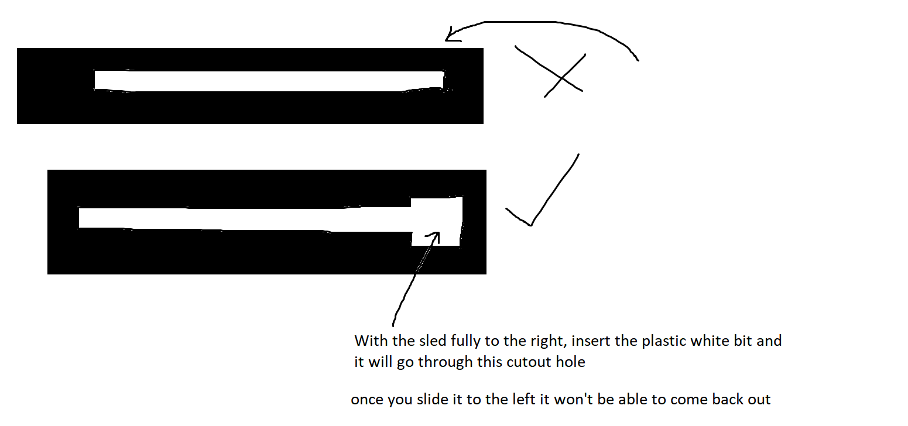
There's a large "hole" at the far end which lets the white part pull right up and off the top.
Flip the laser assembly upside down and you might be able to see a little white "leg" from the toothed white plastic part.
Nudge it away from the spindle, with the tip of a screwdriever, it'll pop out.

Pop the wee fucker out...
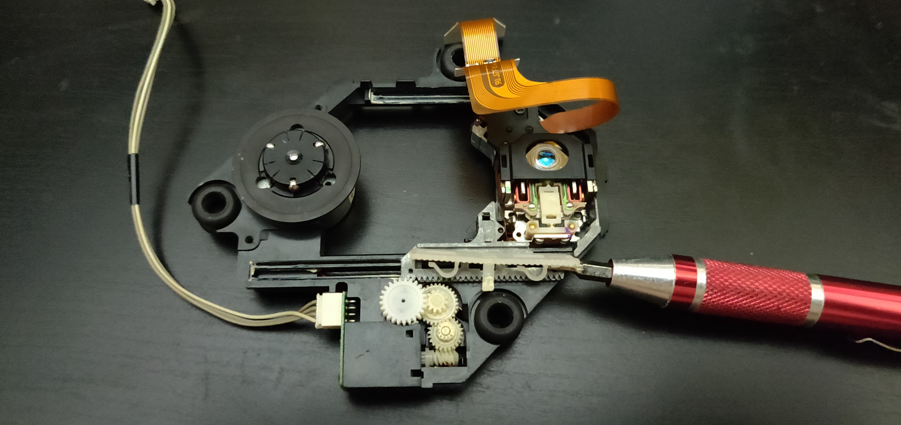

And the laser is free!

If you're struggling, look around where the tip of the screwdriver is.
You should see a little white plastic rectangle.
That's the legs of the white toothed part.
Push it to the right, and through the opening.
The opening is just left of the screwdriver tip.
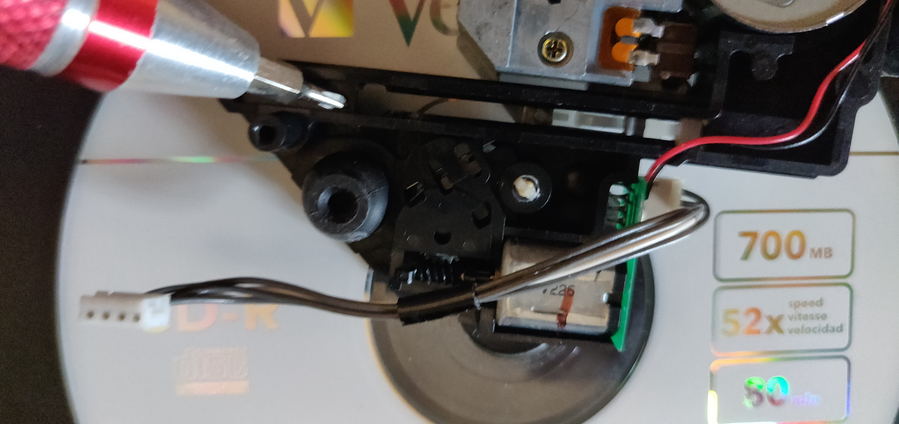

# 9 - Raccoon

# 10 - Remove the protective cover

Screw first.
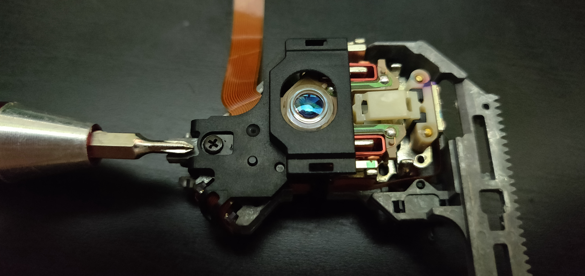

There's a little clip either side of the laser, as shown:
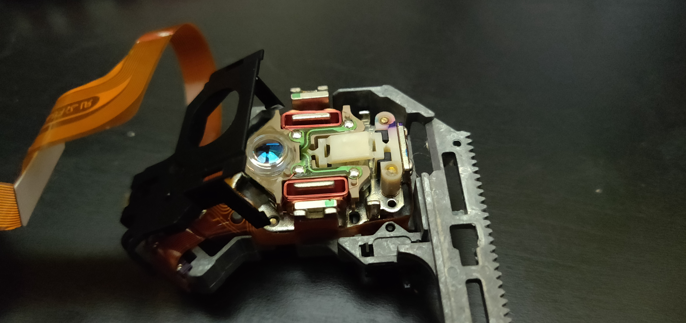

### Warning:
On the edge closest the camera, the ribbon goes over the leg of the clip.
Remove it very gently, starting from the far side, then nearest, then hinge it up.
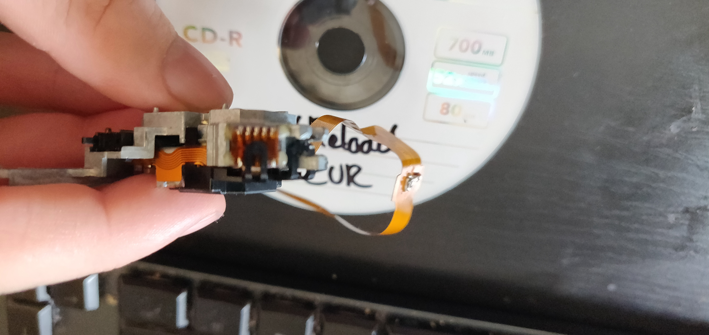

There's a knobbly bit on the left, slide it off to the left.
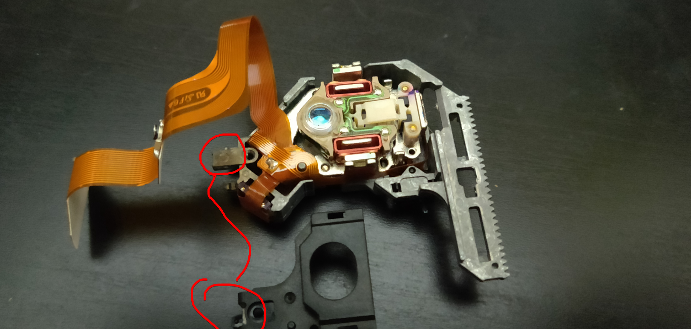

This is the nobbly bit up close, from the previous pic.
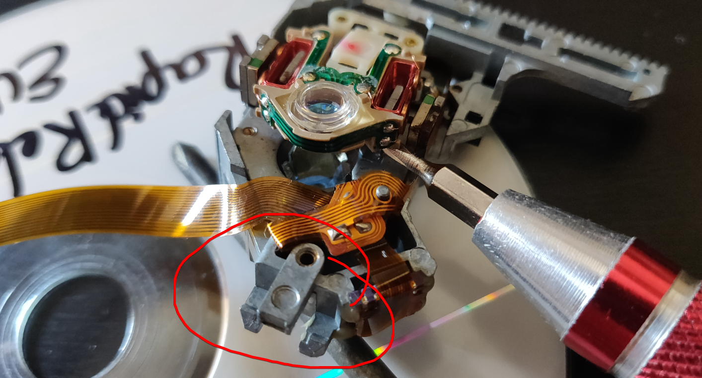

Done!

Extra pics 'cause I took them and don't want them to go to waste.

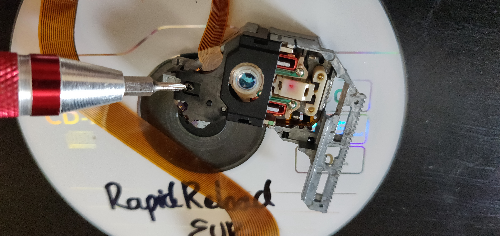

#11 - Take a breather.

Here's your part number.
The good news is you don't need to remove these screws.
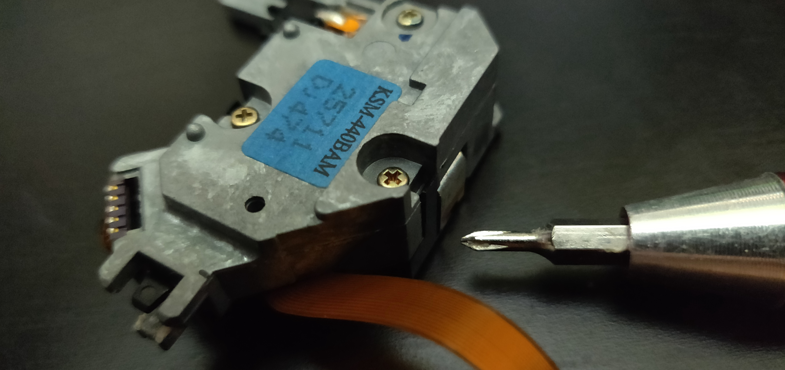
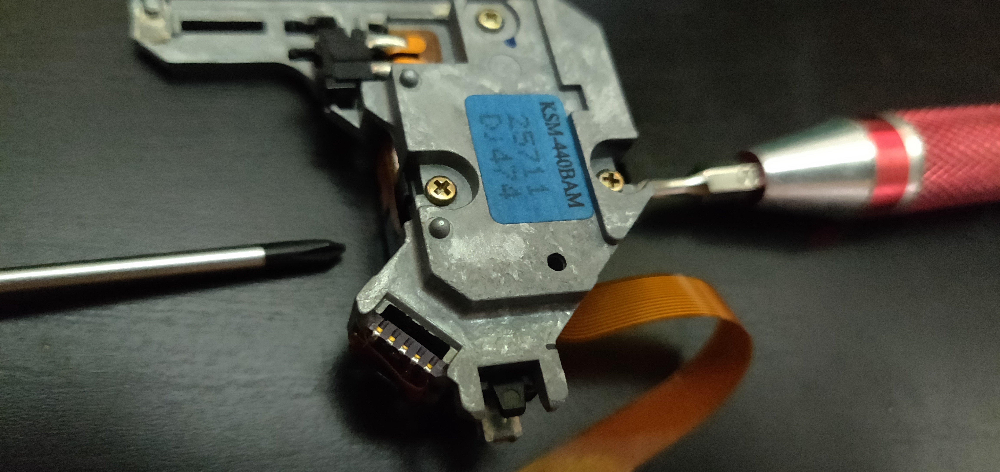

Flip it over.

#12 - Done!

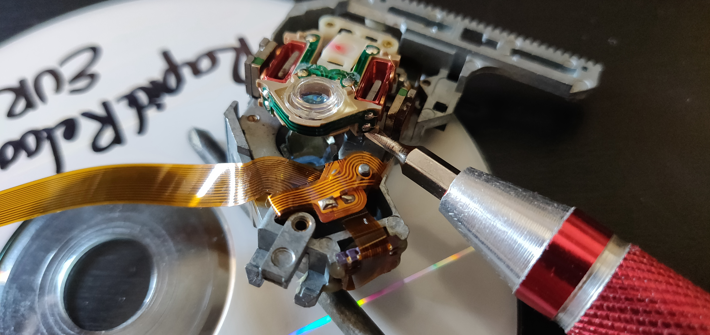

That's us.
Get a Q-Tip/Cotton bud in there with some isopropyl alcohol and give it a wee wipe.
Firm but gentle, try not to leave any streaks.

### Hint!
Make sure you're not pinching the ribbon in the top panel when you put everything back.

# Bonus material

Once it's back together, find this guy:
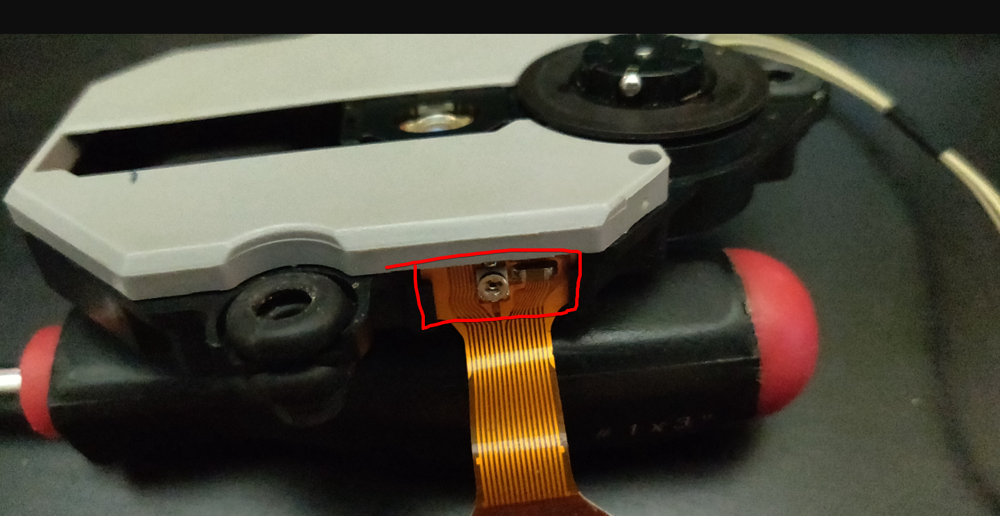

Very small turns (1/12th or so), may dramatically improve CD reading. Rama suggests 12 o'clock for a laser in really good condition, but that most nowadays will require around 1 or 2. Max 3.
(Remember to unplug the console).

There's a caveat, however.
- If you tune it really well for black discs, the performance will suffer on CDRs.
- If you tune it reall well for CDRs, the performance will suffer on black discs.

The less noise the better. If it's squealing, dial it back a bit.
It should reduce overlal wear, but your mileage may vary.

### Hint!
There's a chance that the voltage/current from a multimeter could damage the diode. As such, it might not be best to measure it that way. Instead there's an obvious center notch at 12 o'clock, or a flat bit at the bottom.

